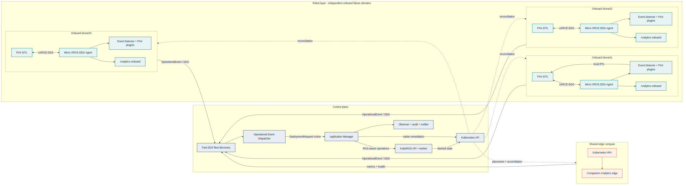

# Cloud-Native ROS 2 and Kubernetes

Piattaforma sperimentale per orchestrare workload robotici ROS 2 e PX4 su
Kubernetes, combinando KubeROS con il pattern event-driven di RobotKube.

Il sistema separa le reazioni safety che devono restare sul drone dalle
operazioni cloud-native coordinate dal control plane. La topologia di
riferimento comprende tre nodi onboard, un nodo edge e un control plane nello
stesso cluster Kubernetes multi-node.

## Architettura



### Onboard, uno stack per drone

- PX4 SITL esegue la missione simulata.
- Micro XRCE-DDS Agent collega PX4 al dominio ROS 2.
- RobotKube Event Detector esegue i plugin PX4 locali.
- Companion Analytics rappresenta un modulo ROS 2 non critico e migrabile.
- La regola `BatteryLow` puo' inviare RTL localmente anche senza control plane.

### Control plane

- KubeROS registra fleet, robot e nodi e gestisce deploy, configurazione,
  placement, update e rollback dei moduli ROS 2.
- Operational Event Dispatcher traduce gli eventi normalizzati in richieste ROS
  2 Action.
- Cloud-Native Application Manager applica le policy P0, P1 e P2, coordina
  KubeROS o le API Kubernetes e verifica la convergenza.
- Audit Writer, Operator Notifier e Platform Observer conservano outcome,
  notifiche e metriche.
- Fast DDS Discovery Server supporta la discovery ROS 2 tra i nodi.

### Edge

Il nodo edge ospita workload trasferiti dallo stack onboard, come Companion
Analytics, e puo' applicare scaling tramite HPA. Non contiene un secondo piano
decisionale.

## Ruolo Dei Framework

**KubeROS** fornisce il livello ROS-aware per fleet, deployment, parametri,
placement e aggiornamenti selettivi. La copia in `integrations/kuberos` include
il supporto sviluppato per workload `Deployment`, revisioni e rollback.

**RobotKube** fornisce il modello event-driven e il core Event Detector a
plugin. Il runtime usa realmente il core upstream in
`integrations/robotkube/event_detector`, esteso dal package
`sources/px4_event_detector_plugin`.

**Kubernetes** riconcilia lo stato dei workload e fornisce Deployment, Job,
Service, ConfigMap, probe, HPA, PVC, Event API e RBAC.

Il componente in `sources/cloud_native_application_manager` e' una
implementazione originale del progetto ispirata al pattern RobotKube. Il
repository Application Manager upstream resta fissato in `integrations` come
riferimento e non rappresenta il manager eseguito da questa architettura.

## Pipeline Event-Driven

```text
PX4 / metriche ROS 2
        |
        v
Event Detector + plugin PX4
        |
        v
OperationalEvent topic
        |
        v
Event Dispatcher
        |
        v
DeploymentRequest action
        |
        v
Application Manager
        |
        +--> KubeROS REST API
        +--> Kubernetes API
        |
        v
verifica outcome, audit e notifica
```

## Scenari Disponibili

| ID | Scenario | Comportamento verificato |
| --- | --- | --- |
| E0 | Baseline a tre droni | Deploy KubeROS e continuita nominale |
| E1 | Batteria bassa | RTL onboard durante indisponibilita del control plane |
| E2 / P1 | Perdita telemetria | Restart del solo Agent e Job diagnostico |
| P2 | Latenza analytics | Migrazione del modulo verso il nodo edge |
| E4 | Remediation fallita | Rollback automatico verso analytics onboard |
| U1 | Update KubeROS | Aggiornamento differenziale di un singolo modulo |
| U2 | Update non valido | Rifiuto della revisione e ripristino della precedente |

Le procedure si trovano nei README sotto `manifests/kubernetes/`. Gli script
salvano gli output locali in `results/`, che non vengono versionati.

## Struttura

```text
cloud_native_ros_kubernetes/
|-- config/          configurazioni e lock delle immagini
|-- containers/      Dockerfile dei componenti eseguiti
|-- docs/            architettura, stato, gap analysis e provenienza
|-- integrations/    KubeROS adattato e dipendenze upstream fissate
|-- interfaces/      messaggi, Service e Action ROS 2
|-- manifests/       input KubeROS e risorse Kubernetes native
|-- patches/         patch riproducibili per dipendenze upstream
|-- results/         output runtime locali, esclusi da Git
|-- scripts/         build, deploy, fault injection e raccolta dati
`-- sources/         componenti ROS 2 e servizi del control plane
```

## Documentazione

- [Specifica architetturale](docs/SPECIFICA_ARCHITETTURALE.md)
- [Stato implementativo](docs/IMPLEMENTATION_STATUS.md)
- [Gap analysis](docs/GAP_ANALYSIS.md)
- [Campagna e scenari](docs/EXPERIMENT_CAMPAIGN.md)
- [Risultati validati](results/README.md)
- [Provenienza dei componenti](docs/THIRD_PARTY_PROVENANCE.md)
- [Workflow immagini e registry](docs/IMAGE_REGISTRY.md)
- [Diagramma Mermaid](docs/diagrams/DISTRIBUTED_ARCHITECTURE.mmd)

## Dipendenze

Dopo il clone inizializzare i submodule upstream:

```bash
git submodule update --init --recursive
```

KubeROS e' versionato direttamente in `integrations/kuberos` per conservare gli
adattamenti del progetto. Le dipendenze RobotKube e PX4 sono fissate nei
submodule dichiarati in `.gitmodules`.

## Avvio Degli Scenari

Ogni scenario dispone di una procedura dedicata. Per esempio:

```bash
scripts/run_e0.sh
scripts/run_e1.sh
scripts/run_e2.sh
scripts/run_p2.sh
scripts/run_e4.sh
```

I runner richiedono Docker, k3d, kubectl e un ambiente ROS 2 compatibile. Le
variabili `RESET_E0`, `RESET_P2` e le equivalenti degli altri scenari
controllano la ricreazione deliberata dei rispettivi cluster.
