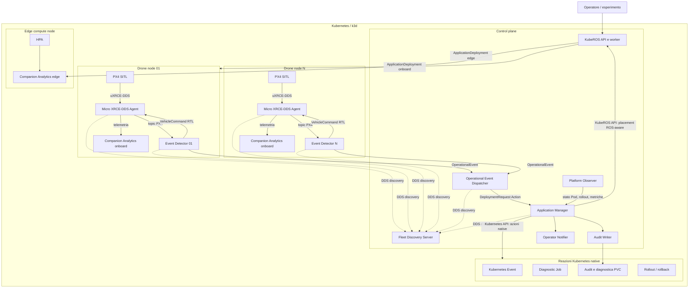

# Specifica Architetturale E Sperimentale

## 1. Identita' Del Documento

| Campo | Valore |
| --- | --- |
| Progetto | Cloud-Native ROS 2 and Kubernetes |
| Stato | Baseline progettuale v1.0 |
| Data | 20 agosto 2026 |
| Obiettivo tecnico | Tecnologie cloud-native per l'integrazione di ROS e Kubernetes in sistemi robotici distribuiti |

Questa specifica fissa l'architettura target, le responsabilita' dei componenti, gli eventi, le regole, gli esperimenti e i criteri di accettazione. Descrive cio' che deve essere realizzato nel nuovo progetto, non lo stato gia' implementato in KubeROS o DroneKube.

## 2. Obiettivo Del Progetto

Valutare fino a che punto workload robotici ROS 2 possano essere orchestrati con tecnologie cloud-native senza trasferire al cluster le decisioni che devono rimanere locali al robot.

La piattaforma deve combinare:

1. KubeROS per deploy, configurazione, operations e placement ROS-aware.
2. Il pattern event-oriented RobotKube per rilevazione, decisione e remediation.
3. Primitive Kubernetes native applicate senza reimplementarne il reconciliation loop.
4. PX4 SITL come caso d'uso robotico ripetibile e controllabile.

### 2.1 Domanda Tecnica Principale

> To what extent can ROS 2 robotic workloads be orchestrated through cloud-native Kubernetes primitives while preserving local safety, enabling distributed deployment, and supporting event-driven adaptation?

### 2.2 Domande Progettuali

- Quali primitive ROS 2 possono essere mappate direttamente su primitive Kubernetes?
- Quali operazioni richiedono una semantica ROS-aware e devono passare da KubeROS?
- Quali decisioni safety devono restare eseguibili sul drone senza edge o control plane?
- Una pipeline event-driven riduce il tempo di rilevazione, reazione e recupero?
- Quali costi introduce la distribuzione in termini di latenza, dipendenza dalla rete e complessita'?
- Il sistema converge automaticamente a uno stato stabile dopo remediation fallite?

### 2.3 Ipotesi Tecniche

- **H1:** KubeROS puo' esprimere deployment, configurazione e placement di moduli ROS 2 distribuiti senza sostituire Kubernetes.
- **H2:** Un Event Detector locale puo' eseguire una reazione safety anche in assenza dell'edge.
- **H3:** La cooperazione tra eventi ROS 2 e stato Kubernetes consente remediation osservabili e ripetibili.
- **H4:** La migrazione di un modulo non critico verso l'edge puo' ripristinare uno SLO senza interrompere PX4.
- **H5:** Un feedback loop con timeout e rollback porta il sistema a uno stato noto anche quando una remediation fallisce.

## 3. Ambito E Non Obiettivi

### 3.1 Incluso

- Una flotta parametrica di almeno tre droni simulati con PX4 SITL.
- Un Event Detector per drone.
- Un Application Manager fleet-level nel control plane.
- Un modulo ROS 2 non critico `companion-analytics`, disponibile onboard ed edge.
- Eventi ROS, segnali Kubernetes e metriche infrastrutturali.
- KubeROS come percorso obbligatorio per deploy, configurazione e placement ROS-aware.
- Kubernetes per lifecycle, health, scaling, diagnostica, audit e rollback nativi.
- Una campagna sperimentale ripetibile `E0-E4`.

### 3.2 Escluso

- Certificazione safety o validazione su un drone reale.
- Controllo di volo offboard affidato a Kubernetes.
- Migrazione live dello stato interno di PX4.
- Collision avoidance e regole di prossimita' multi-drone.
- Hard real-time scheduling nel cluster.
- Modifiche a `dronekube_distributed_systems` o `cybersecurity_dronekube`.
- Iniezione dinamica di nuovo codice C++ attraverso KubeROS.

La demo e' una valutazione in SITL. Il comando safety locale non costituisce un meccanismo certificato.

## 4. Principi Architetturali

1. **Safety locale:** una decisione urgente non deve dipendere dalla connettivita' con l'edge.
2. **Separazione dei piani:** PX4 mantiene il controllo del volo; il cluster governa moduli accessori e operations.
3. **KubeROS realmente nel loop:** una migrazione ROS-aware non puo' essere simulata con un semplice `kubectl apply`.
4. **Kubernetes AS-IS:** probe, controller, Job, Event, HPA e rollback usano API native.
5. **Interfacce tipizzate:** gli eventi e le remediation non usano `std_msgs/String` con JSON come contratto principale.
6. **Reconciliation verificabile:** ogni azione ha un risultato atteso, un timeout e una strategia di fallback.
7. **Idempotenza:** lo stesso incidente non deve generare azioni duplicate.
8. **Audit durevole:** Kubernetes Event e log non sono considerati un archivio permanente.
9. **Configurazione dichiarativa:** soglie, finestre, QoS e placement sono parametri versionati.
10. **Riproducibilita':** fault injection e KPI devono essere prodotti da script, non da operazioni manuali non registrate.

## 5. Architettura Logica



## 6. Distribuzione Dei Componenti

### 6.1 Onboard Per Drone

| Componente | Controller | Responsabilita' |
| --- | --- | --- |
| PX4 SITL | Deployment | Autopilota simulato e missione base |
| Micro XRCE-DDS Agent | Deployment | Bridge tra PX4 uXRCE-DDS e ROS 2 DDS |
| Event Detector | Deployment | Regole locali, normalizzazione e pubblicazione eventi |
| Companion Analytics onboard | Deployment, ROS Lifecycle Node | Elaborazione non critica e fallback locale |

I moduli persistenti non devono essere Pod isolati. Devono essere controllati da Deployment, salvo una motivazione documentata.

### 6.2 Edge Compute

| Componente | Controller | Responsabilita' |
| --- | --- | --- |
| Companion Analytics edge | Deployment + HPA | Elaborazione trasferibile e scalabile |

Il nodo edge e' un target di calcolo condiviso dalla Fleet. Non ospita un
secondo piano decisionale e la perdita dell'edge non interrompe PX4 o la safety
locale.

### 6.3 Control Plane

| Componente | Controller | Responsabilita' |
| --- | --- | --- |
| KubeROS API e worker | Deployment | Fleet, scheduling, deploy e placement ROS-aware |
| Fleet Discovery Server | Deployment | Discovery DDS tra detector, dispatcher e manager |
| Operational Event Dispatcher | Deployment | Topic `OperationalEvent` verso Action `DeploymentRequest` |
| Application Manager | Deployment Recreate + PVC | Policy, remediation, feedback, deduplicazione e outbox persistente |
| Platform Observer | Deployment | Osservazione di Pod, Deployment, Event e metriche |
| Audit Writer | Deployment + PVC | Registro durevole e append-only degli incidenti |
| Operator Notifier | Deployment | Notifica tramite webhook o sink locale verificabile |
| Diagnostic recorder | Job + PVC | Raccolta ROS bag e log per una durata limitata |

KubeROS e i componenti decisionali fleet-level sono eseguiti sul nodo con
ruolo `control_plane`. La Fleet KubeROS rimane il dominio logico che associa
robot, nodi onboard e risorse edge; non introduce un Fleet Edge separato.
KubeROS deve poter:

- registrare cluster, fleet e robot;
- creare `ApplicationDeployment`;
- tradurre `rosParamMap` in ConfigMap;
- selezionare target robot e placement `onboard`/`edge`;
- creare e rimuovere i deployment ROS-aware richiesti dall'Application Manager;
- aggiornare dichiarativamente moduli e placement nello stesso deployment, con revisione e outcome osservabili;
- esporre stato ed errori delle operazioni al feedback loop.

La copia KubeROS in `integrations/kuberos` offre un update replace differenziale
asincrono: i workload invariati vengono preservati, mentre una modifica a
manifest o ConfigMap riavvia soltanto i consumer coinvolti. U1 verifica live il
rollout del singolo modulo; U2 verifica il fallimento osservabile e il rollback
alla revisione precedente. I Deployment ROS non sovrappongono repliche con la
stessa identita' DDS (`maxSurge: 0`) e il gate richiede convergenza completa.

## 7. Confini Di Responsabilita'

| Operazione | Proprietario | Meccanismo |
| --- | --- | --- |
| Deploy iniziale PX4, agent, detector e analytics | KubeROS | ApplicationDeployment |
| Parametri regole e file DDS | KubeROS | rosParamMap, ConfigMap, volume/env |
| Placement onboard/edge | KubeROS | target robot, preference, requirements |
| Creazione replica analytics edge | KubeROS | nuova operazione di deployment ROS-aware |
| Attivazione/deattivazione analytics | ROS 2 | Lifecycle transition |
| Restart di un workload esistente | Kubernetes | Deployment rollout/reconciliation |
| Scaling dopo il placement edge | Kubernetes | HPA |
| Health dei container | Kubernetes | startup, readiness e liveness probe |
| Diagnostica temporanea | Kubernetes | Job |
| Evento operativo visibile nel cluster | Kubernetes | events.k8s.io/v1 Event |
| Persistenza incidenti e KPI | Audit Writer | PVC |
| Rollback di una release | Kubernetes | Deployment rollout undo |
| Rimozione del placement edge | KubeROS | delete dell'ApplicationDeployment target |
| RTL per batteria bassa | Event Detector/PX4 | topic VehicleCommand locale |

Un HPA non deve competere con l'Application Manager sullo stesso campo `replicas`: il manager abilita il workload edge, poi l'HPA ne possiede lo scaling entro i limiti configurati.

## 8. Pipeline Event-Oriented

La pipeline e' composta da cinque fasi osservabili:

1. **Raccolta:** topic ROS 2, stato Kubernetes e metriche infrastrutturali.
2. **Normalizzazione:** conversione in `OperationalEvent` con ID e timestamp comuni.
3. **Decisione:** applicazione di soglie, isteresi, finestre temporali e precondizioni.
4. **Azione:** comando locale, KubeROS API o Kubernetes API a seconda del proprietario.
5. **Feedback:** verifica dell'outcome, recovery, fallback o rollback.

Ogni incidente usa un `correlation_id` stabile dall'evento iniziale al risultato finale.

## 9. Interfacce ROS 2 Target

Le interfacce sono definite nel package `cloud_native_robotics_interfaces`.

### 9.1 OperationalEvent.msg

Contratto proposto:

```text
uint8 SEVERITY_INFO=0
uint8 SEVERITY_WARNING=1
uint8 SEVERITY_CRITICAL=2

uint8 STATE_ENTER=0
uint8 STATE_ACTIVE=1
uint8 STATE_RECOVERED=2
uint8 STATE_FAILED=3

std_msgs/Header header
string event_id
string correlation_id
string source
string robot_id
string component
string event_type
uint8 severity
uint8 state
float64 observed_value
float64 threshold
float64 window_sec
diagnostic_msgs/KeyValue[] attributes
```

Semantica:

- `header.stamp` indica quando la condizione e' stata osservata alla sorgente.
- `event_id` identifica il singolo messaggio.
- `correlation_id` identifica l'intero incidente.
- `source` assume `ros`, `kubernetes` oppure `infrastructure`.
- `state` permette di distinguere ingresso, persistenza, recupero e fallimento.
- `attributes` contiene solo dettagli accessori; i campi usati dalle policy restano tipizzati.

### 9.2 DeploymentRequest.action

Il detector richiede un outcome, ma non invia comandi Kubernetes arbitrari. L'Application Manager decide la sequenza concreta.

```text
# Goal
OperationalEvent event
string policy_id
string requested_outcome
float32 timeout_sec
---
# Result
bool success
string outcome
string final_phase
builtin_interfaces/Time finished_at
bool rollback_performed
diagnostic_msgs/KeyValue[] metrics
---
# Feedback
uint8 PHASE_ACCEPTED=0
uint8 PHASE_ACTING=1
uint8 PHASE_VERIFYING=2
uint8 PHASE_ROLLING_BACK=3
uint8 phase
float32 progress
string message
diagnostic_msgs/KeyValue[] observations
```

Action name di flotta:

```text
/fleet/deployment_request
```

Requisiti:

- goal concorrenti per robot diversi;
- deduplicazione per `correlation_id`;
- feedback durante le operazioni lunghe;
- cancel supportato prima della fase irreversibile;
- risultato esplicito anche dopo timeout;
- retry idempotente.

### 9.3 GetHealthSnapshot.srv

Il Lifecycle node Companion Analytics espone uno snapshot sincrono per
distinguere la raggiungibilita' DDS dallo stato applicativo effettivo.

```text
# Request
string correlation_id
---
# Response
std_msgs/Header header
string correlation_id
bool healthy
string robot_id
string component
string instance_id
string lifecycle_state
float64 latency_ms
uint32 queue_depth
float64 cpu_percent
string detail
```

Il Service non modifica lo stato del workload. `healthy=true` richiede che il
nodo sia Lifecycle `active` e che il publisher delle metriche sia configurato.
Il `correlation_id` e' restituito senza modifiche per collegare richiesta ed
evidenza sperimentale.

### 9.4 Topic, Service E Action

| Nome | Tipo | QoS | Uso |
| --- | --- | --- | --- |
| `/fleet/operational_events` | OperationalEvent | reliable, transient local, depth 100 | stream normalizzato |
| `/robot_id/analytics/latency` | MetricSample | reliable, depth 50 | latenza e queue depth |
| `/robot_id/companion/{onboard,edge}/health` | GetHealthSnapshot | reliable | snapshot diagnostico sincrono dell'istanza selezionata |
| `/fleet/deployment_request` | DeploymentRequest Action | reliable | goal, feedback, result e cancel |

Il topic eventi non sostituisce l'audit persistente.

## 10. Catalogo Definitivo Delle Regole

### 10.1 P0 BatteryLowRule

**Scopo:** dimostrare una reazione safety locale indipendente da Kubernetes.

**Sorgente:** `/fmu/out/battery_status_v1`.

**Precondizioni:**

- batteria con `connected=true`;
- messaggio non piu' vecchio di 2 secondi;
- valore `remaining` valido tra 0 e 1.

**Ingresso:** `remaining < 0.20` per tre campioni consecutivi.

**Uscita:** `remaining >= 0.25` per tre campioni consecutivi.

**Stati:**

```text
NORMAL
  -> LOW_ACTIVE
  -> COMMAND_SENT
  -> COMMAND_ACKNOWLEDGED | COMMAND_UNACKNOWLEDGED
  -> RECOVERED
```

**Azioni locali:**

1. Pubblicazione di `VEHICLE_CMD_NAV_RETURN_TO_LAUNCH` su `/fmu/in/vehicle_command`.
2. Osservazione di `/fmu/out/vehicle_command_ack` e `VehicleStatus.nav_state`.
3. Massimo tre tentativi configurabili nella sola demo SITL.
4. Un solo comando per incidente attivo, salvo retry esplicito per mancato ack.

**Azioni asincrone non bloccanti:**

- pubblicazione di `BatteryLow` e relativo recovery;
- Kubernetes Event;
- audit persistente;
- Job diagnostico;
- notifica operatore.

Se l'edge non e' raggiungibile, l'evento viene accodato localmente in un buffer limitato e inoltrato quando la connessione torna disponibile. Il comando RTL non attende l'inoltro.

### 10.2 P1 TelemetryHeartbeatRule

**Scopo:** dimostrare recovery cloud-native del bridge senza riavviare PX4.

**Sorgente:** `VehicleStatus` ricevuto attraverso Micro XRCE-DDS Agent.

**Precondizioni:**

- startup grace di 60 secondi;
- almeno un messaggio `VehicleStatus` ricevuto;
- PX4 Pod osservato come disponibile dal Platform Observer.

**Ingresso:** nessun messaggio per piu' di 5 secondi.

**Uscita:** tre messaggi consecutivi ricevuti entro 3 secondi.

**Cooldown:** 60 secondi dopo la chiusura dell'incidente.

**Remediation:**

1. invio del goal `restore_telemetry`;
2. Kubernetes Event e audit;
3. restart del solo Deployment Micro XRCE-DDS Agent;
4. avvio di un Job diagnostico di 5 minuti;
5. verifica della ripresa dei messaggi;
6. chiusura con `RECOVERED` oppure escalation a P3.

PX4 non deve essere riavviato. Se PX4 non e' disponibile, il manager non applica automaticamente la policy del bridge: registra la causa differente, raccoglie diagnostica e notifica l'operatore.

### 10.3 P2 AnalyticsLatencySLORule

**Scopo:** dimostrare placement KubeROS, lifecycle ROS 2 e scaling Kubernetes di un modulo non critico.

**Modulo:** `companion-analytics`, implementato come ROS 2 Lifecycle Node.

**Segnali:**

- latenza end-to-end del modulo;
- queue depth;
- CPU del Pod come evidenza contestuale.

**Ingresso:** p95 della latenza maggiore di 250 ms per tre finestre consecutive da 10 secondi.

**Evidenza aggiuntiva:** CPU maggiore dell'80% oppure queue depth maggiore di 10. Questi segnali non attivano da soli la regola.

**Uscita:** p95 minore di 150 ms per tre finestre consecutive.

**Remediation:**

1. invio del goal `restore_analytics_slo`;
2. richiesta a KubeROS di creare `analytics-edge-<robot_id>` con placement edge;
3. attesa della readiness Kubernetes;
4. transizione `configure` e `activate` del Lifecycle Node edge;
5. routing del flusso verso l'istanza edge;
6. transizione `deactivate` dell'istanza onboard solo dopo la readiness edge;
7. abilitazione HPA edge con `minReplicas=1`, `maxReplicas=3` e CPU target iniziale del 70%;
8. verifica dello SLO e chiusura oppure P3.

L'istanza onboard resta il fallback. La missione PX4 non deve dipendere dall'analytics.

### 10.4 P3 RemediationOutcomePolicy

**Scopo:** dimostrare il feedback loop e la convergenza dopo un'azione fallita.

**Ingresso, una delle condizioni:**

- nuova replica non Ready entro 60 secondi;
- latenza non rientrata sotto lo SLO entro 90 secondi;
- almeno tre restart del target in 5 minuti;
- goal Action scaduto o cancellato senza stato stabile.

**Azioni:**

1. feedback `ROLLING_BACK` sul goal;
2. rollback Kubernetes della release se applicabile;
3. riattivazione del Lifecycle Node onboard;
4. verifica del fallback;
5. rimozione del deployment edge tramite KubeROS;
6. Kubernetes Event `RemediationFailed`;
7. audit con outcome e motivazione;
8. notifica operatore.

**Uscita:** fallback onboard Active e pipeline analytics nuovamente funzionante, anche se con prestazioni degradate esplicitamente registrate.

## 11. Regole Escluse Dalla Demo Principale

| Regola | Motivazione |
| --- | --- |
| Proximity | Richiede geometria e stato multi-UAV, ma non migliora la valutazione KubeROS |
| Failsafe automatico generico | Troppo vicino al controllo flight-critical |
| CPU-only | Segnale rumoroso e dipendente dall'hardware |
| PodCrash come evento primario | Kubernetes possiede gia' il reconciliation loop |
| Restart PX4 | Rischia di confondere orchestrazione accessoria e controllo di volo |

Gli eventi Kubernetes restano segnali del feedback loop, non duplicazioni dei controller nativi.

## 12. Configurazione Delle Regole Attraverso KubeROS

Ogni Event Detector contiene plugin precompilati. KubeROS seleziona e configura i plugin attraverso `rosParamMap`.

Esempio logico:

```yaml
enabled_rules:
  - battery_low
  - telemetry_heartbeat
battery_low:
  threshold: 0.20
  reset_threshold: 0.25
  consecutive_samples: 3
  max_message_age_sec: 2.0
telemetry_heartbeat:
  startup_grace_sec: 60
  timeout_sec: 5
  recovery_samples: 3
  cooldown_sec: 60
```

Vincoli:

- modificare soglie o abilitare un plugin esistente non richiede una nuova immagine;
- aggiungere codice di una nuova regola richiede build e rollout di una nuova immagine;
- il caricamento a caldo e' opzionale; nella baseline e' sufficiente un rollout dichiarativo;
- ogni configurazione usata in un esperimento viene archiviata con i risultati.

## 13. Integrazione Con KubeROS

L'Application Manager usa un adapter KubeROS con operazioni minime:

```text
create_deployment(spec) -> operation_id
get_deployment(operation_id | deployment_id) -> state
update_deployment(spec) -> event_id, target_revision
wait_revision(deployment_id, revision, timeout) -> outcome
delete_deployment(deployment_id) -> operation_id
wait_ready(deployment_id, timeout) -> outcome
```

L'adapter traduce queste operazioni nelle API `create`, `info/list`,
`PATCH update` e `delete`; U1 e U2 verificano live update, polling di
revisione/evento e rollback.

La migrazione analytics usa una sequenza blue/green:

1. mantenere l'istanza onboard Active;
2. creare un nuovo ApplicationDeployment edge tramite KubeROS;
3. attendere Pod Ready e Lifecycle Active;
4. spostare il routing;
5. disattivare onboard;
6. mantenere onboard disponibile come fallback;
7. eliminare edge tramite KubeROS in caso di rollback.

### 13.1 Criterio Di Validita' KubeROS

Un esperimento P2 e' valido solo se i log dimostrano:

- richiesta ricevuta dall'Application Manager;
- chiamata all'API KubeROS con `correlation_id`;
- ApplicationDeployment creato da KubeROS;
- workload collocato sul nodo edge;
- parametri ROS forniti tramite KubeROS;
- stato finale restituito al feedback loop.

Un manifest Kubernetes applicato direttamente non soddisfa questo criterio.

## 14. Primitive ROS 2 Coperte

| Primitiva ROS 2 | Uso Nel Progetto | Mappatura Kubernetes |
| --- | --- | --- |
| Node | detector, analytics, manager, notifier | container in Pod |
| Topic | telemetria, metriche, OperationalEvent | rete DDS tra Pod |
| Service | snapshot health companion | endpoint applicativo raggiunto tramite discovery ROS 2 |
| Action | DeploymentRequest | goal/feedback/result tra detector e manager |
| Parameter | regole, soglie, topic e QoS | ConfigMap generata da rosParamMap |
| Lifecycle Node | analytics onboard/edge | readiness coordinata con stato ROS |
| DDS discovery | locale per drone e fleet-level | Service, DNS e profili FastDDS |
| QoS | sensor data, eventi e controllo | profili coerenti con affidabilita' e rete |

## 15. Primitive Kubernetes Coperte

### 15.1 Obbligatorie Nella Demo

| Primitiva | Uso |
| --- | --- |
| Pod lifecycle | osservazione Pending, Running, Failed e Succeeded |
| Deployment | tutti i moduli persistenti |
| Job | raccolta diagnostica a durata limitata |
| Service/DNS/EndpointSlice | discovery dei servizi edge e KubeROS |
| ConfigMap | parametri ROS, policy e profili DDS |
| Secret | token KubeROS e webhook operatore |
| PV/PVC/StorageClass | audit, outbox manager e diagnostica persistenti |
| Event API | marcatura best-effort degli incidenti nel cluster |
| Probes | startup, readiness e liveness specifiche per componente |
| Reconciliation | recovery dei workload controller-managed |
| HPA | scaling analytics edge |
| RBAC | privilegi minimi per manager e observer |
| Rollout/rollback | update differenziale U1, rollback revisione U2 e fallback E4 |

### 15.2 Da Documentare Senza Forzarne L'Uso

| Primitiva | Trattamento |
| --- | --- |
| NetworkPolicy | opzione per limitare flussi DDS, API e storage; non istanziata nella demo |
| ResourceQuota/LimitRange | opzioni per la governance del namespace; non istanziate nella demo |
| StatefulSet | alternativa per un database audit replicato |
| CronJob | aggregazione KPI periodica, non necessaria alla reazione |
| DaemonSet | alternativa per collector per-nodo |
| VPA | opzione di right-sizing, esclusa per evitare conflitti sperimentali |

La documentazione spiega perche' una primitiva non viene usata quando non porta valore al caso PX4.

## 16. DDS Discovery E QoS

La configurazione finale usa un Fast DDS Discovery Server condiviso nel control plane.
I droni mantengono identita' logiche distinte tramite namespace ROS 2, namespace
uXRCE-DDS, robot ID e placement sui nodi onboard. Event Detector, dispatcher,
Application Manager e analytics usano lo stesso servizio di discovery per i
flussi fleet-level; non sono stati istanziati Discovery Server locali per drone.

Profili iniziali:

| Flusso | Reliability | Durability | History |
| --- | --- | --- | --- |
| Telemetria PX4 | best effort | volatile | keep last 10 |
| Metriche analytics | reliable | volatile | keep last 50 |
| OperationalEvent | reliable | transient local | keep last 100 |
| DeploymentRequest Action | reliable | secondo default ROS 2 Action | bounded |
| VehicleCommand | reliable se compatibile con PX4 bridge | volatile | keep last 10 |

Le scelte QoS devono essere verificate con `ros2 topic info --verbose` e archiviate nei risultati.

## 17. Probes E Lifecycle

Le probe verificano la salute del processo; il Lifecycle ROS 2 verifica lo stato funzionale.

| Componente | Startup | Readiness | Liveness |
| --- | --- | --- | --- |
| PX4 SITL | processo e porta uXRCE avviati | heartbeat disponibile | processo vivo |
| Micro XRCE Agent | processo avviato | sessione/traffico disponibile | processo responsivo |
| Event Detector | executor ROS avviato | subscription e fleet action disponibili | callback timer responsivo |
| Analytics | processo avviato | Lifecycle Active e output recente | executor responsivo |
| Application Manager | client API caricati | Action server e KubeROS raggiungibili | executor responsivo |

La readiness dell'analytics edge non passa finche' il nodo non e' `Active`. La disattivazione onboard avviene solo dopo questa condizione.

## 18. Sicurezza E Governance

- ServiceAccount separati per detector, manager, observer e diagnostic Job.
- Nessun ruolo `cluster-admin` per componenti applicativi.
- Il manager puo' modificare solo i workload e gli eventi del namespace assegnato.
- L'observer ha permessi read-only su Pod, Deployment, Event e metriche.
- Il detector non possiede credenziali Kubernetes.
- Token KubeROS e webhook sono Secret, non ConfigMap.
- NetworkPolicy e' una misura prevista per produzione, ma non e' istanziata nei manifest della demo.
- Resource request e limit sono obbligatori per analytics, manager e diagnostica.
- Immagini identificate da tag immutabile o digest durante la campagna finale.
- Ogni eccezione privilegiata richiesta da PX4 o rete host viene motivata nel threat model operativo.

## 19. Osservabilita' E Audit

Ogni incidente produce:

1. `OperationalEvent` ROS 2.
2. Kubernetes Event con `correlation_id`.
3. record audit persistente.
4. log strutturati del detector e manager.
5. metriche temporali.
6. risultato della DeploymentRequest Action.
7. riferimento al Job diagnostico, quando creato.
8. record di notifica operatore.

Record audit minimo:

```text
correlation_id
event_id
robot_id
event_type
source_timestamp
manager_received_timestamp
decision_timestamp
action_started_timestamp
verification_started_timestamp
completed_timestamp
requested_outcome
actions_executed
success
rollback_performed
failure_reason
artifacts
```

Kubernetes Event e' usato per visibilita' operativa. Il PVC e' la fonte durevole per analisi e riproducibilita'.

Il reporter del manager usa un outbox SQLite FIFO su PVC con consegna
`at-least-once`: inserisce prima della chiamata HTTP e rimuove solo dopo
successo. Il Deployment usa `Recreate` per mantenere un unico Action server e
un unico consumer durante i rollout. Il Platform Observer consulta anche
`metrics.k8s.io`, normalizza CPU in millicore e memoria in byte e continua a
produrre snapshot lifecycle quando Metrics Server non e' disponibile.

## 20. Campagna Sperimentale Definitiva

### E0: Baseline Nominale

**Procedura:** deploy della flotta tramite KubeROS, avvio missione hover/waypoint e osservazione senza fault.

**Dimostra:** placement, ConfigMap, DDS discovery, probe e assenza di falsi positivi.

**Successo:** tutti i Pod Ready, analytics Active, nessuna remediation inattesa e telemetria continua.

### E1: BatteryLow Con Edge Disconnesso

**Procedura:** isolare il detector dal piano fleet e iniettare una batteria simulata sotto il 20%.

**Dimostra:** autonomia locale e separazione tra safety e orchestrazione.

**Successo:** comando RTL inviato e osservato senza edge; evento accodato e inoltrato dopo il ripristino della rete; PX4 non riavviato.

### E2: Perdita Telemetria

**Procedura:** interrompere il percorso Micro XRCE-DDS mantenendo PX4 attivo.

**Dimostra:** rilevazione ROS, correlazione con stato Kubernetes, restart nativo e Job diagnostico.

**Successo:** evento dopo 5 secondi, restart del solo agent, ripresa di tre heartbeat, chiusura dell'incidente e diagnostica registrata.

### E3: Violazione SLO Analytics

**Procedura:** applicare carico ripetibile al companion analytics fino a superare p95 250 ms.

**Dimostra:** KubeROS nel runtime loop, placement edge, Lifecycle Node e HPA.

**Successo:** workload edge creato tramite KubeROS, Ready e Active; routing trasferito; p95 sotto 150 ms; PX4 continuo.

### E4: Remediation Fallita E Rollback

**Procedura:** distribuire intenzionalmente una variante analytics edge che non supera la readiness.

**Dimostra:** timeout, feedback Action, rollback, fallback e convergenza.

**Successo:** errore rilevato entro 60 secondi, onboard riattivato, edge rimosso/rollbackato, audit e notifica completi.

Ogni esperimento viene ripetuto almeno 10 volte nella campagna finale. Pilot run e campagne non valide vengono conservati ma marcati separatamente.

## 21. KPI E Definizioni

| KPI | Definizione |
| --- | --- |
| Detection time | `event_observed - fault_injected` |
| Reaction time | `action_started - event_observed` |
| Recovery time | `stable_recovered - fault_injected` |
| MTTR | media del recovery time per tipo di incidente |
| Convergence time | `final_stable_state - remediation_goal_accepted` |
| Safety command latency | `vehicle_command_sent - battery_threshold_crossed` |
| Ack latency | `vehicle_command_ack - vehicle_command_sent` |
| Analytics latency | media, p95 e p99 per finestra |
| Mission continuity | assenza di restart PX4 e continuita' di heartbeat/nav state |
| Remediation success rate | remediation concluse con outcome / remediation avviate |
| Rollback rate | rollback / remediation avviate |
| Audit completeness | campi/artifact presenti / campi/artifact attesi |
| Duplicate action rate | azioni duplicate / incidenti unici |

Tutti i timestamp usano clock monotonic per le durate e UTC per la correlazione tra processi. La sincronizzazione dei nodi viene verificata prima della campagna.

## 22. Criteri Di Accettazione Della Piattaforma

- Deploy completo ripetibile da ambiente pulito con un singolo comando documentato.
- Almeno tre droni simulati gestiti dalla stessa istanza KubeROS.
- Un Event Detector indipendente per drone.
- Nessun contratto principale basato su JSON in `std_msgs/String`.
- Tutte le remediation correlate da ID unico e idempotenti.
- E1 completato anche con Application Manager irraggiungibile.
- E2 non riavvia PX4.
- E3 crea il target edge passando dall'API KubeROS.
- E4 torna a un analytics onboard Active entro 120 secondi.
- Il 100% degli incidenti validi produce record audit e outcome Action.
- Nessun falso positivo durante E0 nel periodo nominale definito.
- Configurazioni, immagini, manifest e risultati versionati per ogni run.

Le soglie temporali possono essere calibrate durante i pilot. Dopo la calibrazione vengono congelate prima della campagna finale e non modificate per migliorare retroattivamente i risultati.

## 23. Matrice Di Tracciabilita' Dei Requisiti

| Richiesta | Realizzazione | Verifica |
| --- | --- | --- |
| KubeROS per deploy/operations ROS 2 | ApplicationDeployment, rosParamMap, adapter KubeROS | E0, E3 e log API correlati |
| Pattern RobotKube con valore reale | Event Detector plugin-based e Application Manager Action server | E1-E4 |
| ROS Node | detector, analytics, manager, notifier | grafo ROS e Pod inventory |
| ROS Topic | telemetria, metriche, OperationalEvent | topic graph e QoS report |
| ROS Service | GetHealthSnapshot del companion onboard/edge | chiamata correlata durante E0 ed E3/P2 |
| ROS Action | Remediation goal/feedback/result/cancel | trace E2-E4 |
| ROS Parameter | regole, soglie, topic e QoS | ConfigMap generata da KubeROS |
| Lifecycle Node | analytics onboard ed edge | transizioni E3/E4 |
| DDS discovery e QoS | Discovery Server fleet-level condiviso e namespace per robot | report DDS e test connettivita' |
| Pod lifecycle e controller | Deployment persistenti e Job diagnostici | E0, E2, E4, U1, U2 |
| Probes e resilienza | startup/readiness/liveness specifiche | fault E2 ed edge non Ready E4 |
| Service discovery | Service, DNS ed EndpointSlice | inventario E0 |
| Config e Secret lifecycle | rosParamMap/ConfigMap e credenziali Secret | E0, E3 |
| Storage lifecycle | PVC audit e diagnostica | E1-E4 |
| Event API Kubernetes | evento per ogni incidente | E1-E4 |
| Reconciliation | controller Kubernetes, verifica manager e revisioni KubeROS | E2, E4, U1, U2 |
| Scalabilita' | HPA analytics edge | E3 |
| RBAC | account e permessi namespaced minimi | manifest e test degli adapter |
| NetworkPolicy, Quota e LimitRange | primitive analizzate, non istanziate nella demo | limite dichiarato del progetto |
| Rollout/rollback | update analytics valido e revisione difettosa | U1, U2; fallback applicativo E4 |
| Raccolta ROS/K8s/infra | detector e Platform Observer | E2-E4 |
| Normalizzazione | OperationalEvent tipizzato | test interfaccia ed audit |
| Policy e soglie QoS/SLO | P0-P3 | unit test e fault injection |
| Azione automatica | RTL, restart, placement, HPA, Job e rollback | E1-E4 |
| Feedback loop | DeploymentRequest Action e P3 | E2-E4 |
| Safety fuori da Kubernetes | BatteryLow e RTL locale | E1 con edge isolato |
| Continuita' missione PX4 | nessun restart PX4 per remediation accessorie | E1-E4 |
| KPI richiesti | reaction, recovery, MTTR, p95, rollback e log | dataset finale |

Questa matrice e' anche la checklist minima del progetto: una riga priva di artifact sperimentale deve essere dichiarata come limite, non considerata implicitamente soddisfatta.

## 24. Strategia Di Riuso

Il progetto non copia interi repository. Ogni elemento candidato viene valutato rispetto alla specifica.

### 24.1 Da KubeROS

Candidati:

- API e modelli `ApplicationDeployment`;
- registrazione cluster/fleet/robot;
- `rosModules`, `rosParamMap` e `rosParameters`;
- generatori di manifest e profili FastDDS;
- baseline PX4 SITL per-drone;
- script di reset e deploy, dopo semplificazione.

### 24.2 Da DroneKube Originale

Candidati:

- framework Event Detector e API plugin;
- struttura delle regole PX4;
- pattern ROS 2 Action dell'Application Manager;
- generazione di Job rosbag2 on-event;
- utility per creare/eliminare risorse Kubernetes.

Il contratto `DeploymentRequest` originale e la regola low battery sono riferimenti, non interfacce target definitive. La nuova Action e il nuovo evento seguono questa specifica.

### 24.3 Regole Di Provenienza

Prima di copiare codice:

1. verificare licenza e copyright del file sorgente;
2. registrare repository, commit, percorso e motivazione;
3. distinguere copia, adattamento e riscrittura;
4. mantenere gli header richiesti dalla licenza;
5. aggiungere test nel nuovo progetto;
6. rimuovere nomi, namespace e assunzioni non pertinenti.

Verranno creati `docs/GAP_ANALYSIS.md` e `docs/THIRD_PARTY_PROVENANCE.md` prima della prima copia.

## 25. Struttura Target Del Progetto

```text
cloud_native_ros_kubernetes/
|-- docs/
|   |-- SPECIFICA_ARCHITETTURALE.md
|   |-- GAP_ANALYSIS.md
|   |-- THIRD_PARTY_PROVENANCE.md
|   `-- EXPERIMENT_PROTOCOL.md
|-- interfaces/
|   `-- cloud_native_robotics_interfaces/
|-- sources/
|   |-- event_detector/
|   |-- px4_event_rules/
|   |-- application_manager/
|   |-- platform_observer/
|   |-- companion_analytics/
|   |-- audit_writer/
|   `-- operator_notifier/
|-- manifests/
|   |-- kuberos/
|   `-- kubernetes/
|-- experiments/
|   |-- faults/
|   |-- scenarios/
|   `-- analysis/
|-- scripts/
`-- results/
```

## 26. Piano Di Implementazione

### Fase A: Gap Analysis

- inventario dei componenti KubeROS e DroneKube originali;
- verifica licenze;
- decisione `reuse`, `adapt` o `rewrite` per ciascun componente;
- test della baseline KubeROS esistente.

### Fase B: Contratti

- package `cloud_native_robotics_interfaces`;
- `OperationalEvent.msg`;
- `DeploymentRequest.action`;
- test di serializzazione, Action feedback, cancel e timeout.

### Fase C: Safety E Recovery

- Event Detector per-drone plugin-based;
- BatteryLowRule completa di ack e buffer locale;
- TelemetryHeartbeatRule;
- Application Manager minimo e audit;
- esperimenti E0-E2.

### Fase D: Placement E Lifecycle

- companion analytics Lifecycle Node;
- adapter KubeROS;
- placement edge e routing;
- HPA;
- esperimento E3.

### Fase E: Feedback E Rollback

- Platform Observer;
- RemediationOutcomePolicy;
- rollback e notifier;
- esperimento E4.

### Fase F: Campagna Finale

- automazione reset/deploy/fault/collect;
- almeno 10 run per scenario;
- analisi statistica e grafici;
- tracciamento completo di configurazioni e immagini.

## 27. Decisioni Congelate

- Nuovo progetto separato dalle baseline originali KubeROS e DroneKube.
- Estensioni KubeROS sviluppate solo nella copia integrations/kuberos.
- KubeROS baseline e DroneKube originale sono le sole sorgenti iniziali di riuso.
- Un Event Detector per drone.
- Application Manager fleet-level nel control plane.
- BatteryLow resta una policy safety locale.
- Eventi principali: BatteryLow, TelemetryHeartbeatLost e AnalyticsLatencySLO.
- Feedback policy obbligatoria per readiness, SLO e restart loop.
- Interfacce ROS 2 tipizzate.
- KubeROS gestisce deploy/configurazione/placement ROS-aware.
- Kubernetes gestisce lifecycle e primitive native.
- Moduli persistenti gestiti da Deployment.
- Diagnostica temporanea gestita da Job con PVC.
- Audit persistente separato da Kubernetes Event.
- Proximity e controllo offboard fuori dallo scope principale.
- Campagna `E0-E4` come dimostrazione finale.

## 28. Decisioni Da Chiudere Dopo La Gap Analysis

Questi punti non cambiano l'architettura e devono essere chiusi prima dell'implementazione relativa:

- licenze e porzioni di codice effettivamente riusabili;
- formato interno dell'Audit Writer, SQLite o JSONL append-only;
- meccanismo di routing analytics onboard/edge;
- endpoint preciso dell'API KubeROS e autenticazione;
- metodo ripetibile di fault injection del link XRCE;
- metrica HPA disponibile nel cluster finale;
- versione definitiva di ROS 2, PX4 e immagini container.

## 29. Definition Of Done Del Progetto

Il progetto e' completo quando:

1. la piattaforma viene creata da zero con documentazione ripetibile;
2. KubeROS e' osservabile nel deploy iniziale e nella remediation E3;
3. ROS 2 Node, Topic, Service, Action, Parameter, Lifecycle e DDS/QoS sono dimostrati;
4. le primitive Kubernetes obbligatorie sono usate e raccolte nei risultati;
5. E0-E4 terminano con criteri automatici pass/fail;
6. i KPI sono calcolati da timestamp e artifact, non da stime manuali;
7. sicurezza locale, recovery cloud-native e ottimizzazione edge sono distinguibili;
8. limiti, failure mode e risultati negativi sono documentati;
9. codice riusato e modifiche sono tracciati;
10. la documentazione tecnica deriva dalle configurazioni e dai risultati verificati.

## 30. Riferimenti Di Base

- [KubeROS](https://kuberos.io/)
- [KubeROS Concept](https://kuberos.io/docs/concept/)
- [RobotKube paper](https://arxiv.org/abs/2308.07053)
- [ROS 2 Concepts](https://docs.ros.org/en/humble/Concepts.html)
- [ROS 2 Managed Nodes](https://design.ros2.org/articles/node_lifecycle.html)
- [PX4 ROS 2 User Guide](https://docs.px4.io/main/en/ros2/)
- [Micro XRCE-DDS bridge](https://docs.px4.io/main/en/middleware/uxrce_dds.html)
- [Kubernetes Workloads](https://kubernetes.io/docs/concepts/workloads/)
- [Kubernetes Probes](https://kubernetes.io/docs/tasks/configure-pod-container/configure-liveness-readiness-startup-probes/)
- [Kubernetes Events API](https://kubernetes.io/docs/reference/kubernetes-api/cluster-resources/event-v1/)
- [Kubernetes HPA](https://kubernetes.io/docs/tasks/run-application/horizontal-pod-autoscale/)
- [Kubernetes RBAC](https://kubernetes.io/docs/reference/access-authn-authz/rbac/)
